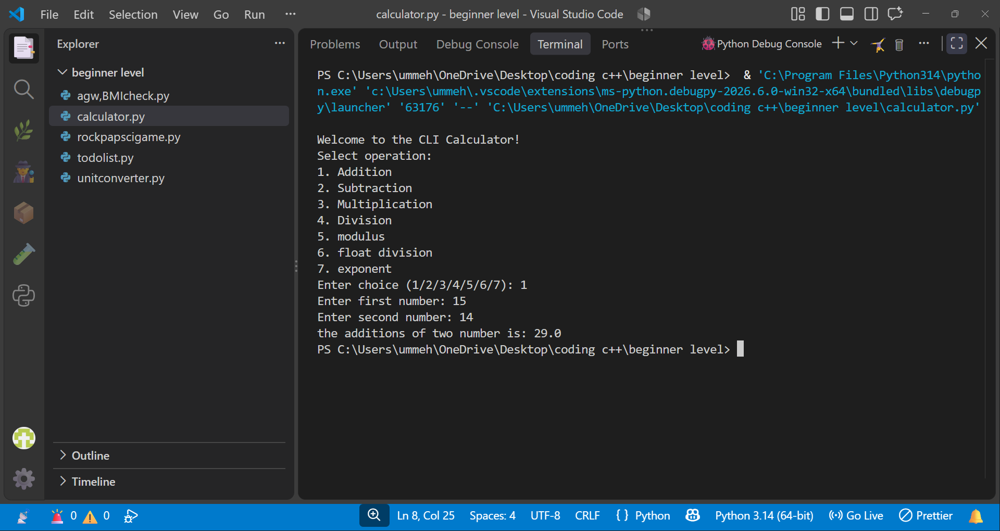
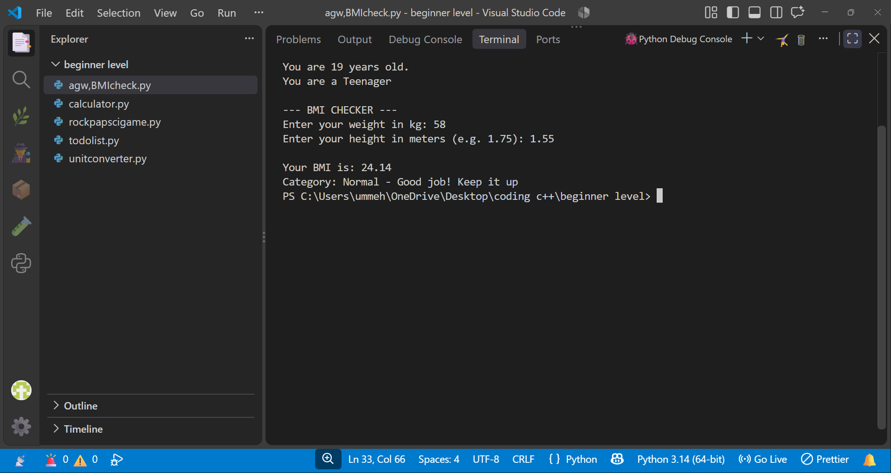
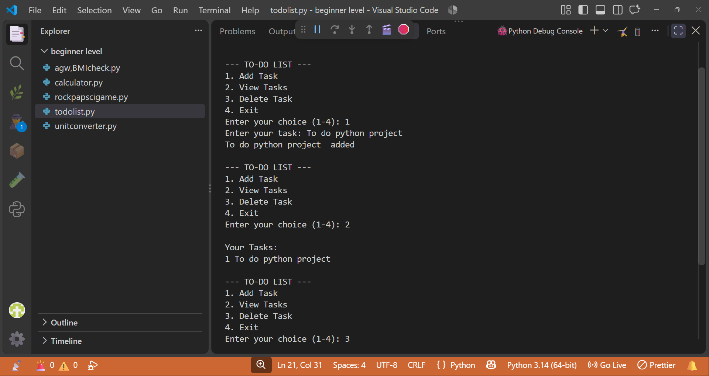
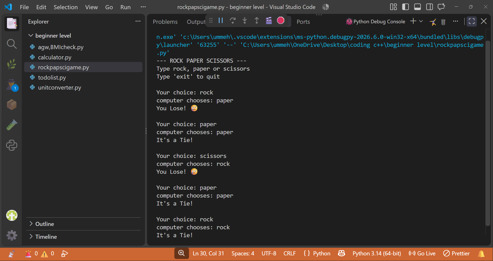
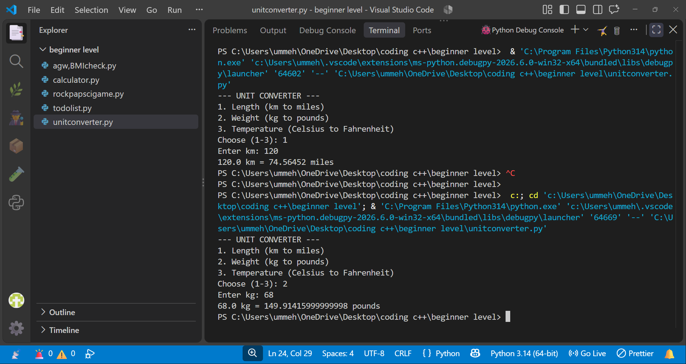

# Python Beginner Projects
A collection of 6 beginner Python projects built with core Python logic.

## 📁 Projects Output

### 01 - Calculator


### 02 - Age & BMI Checker


### 03 - To-Do List


### 04 - Rock Paper Scissors


### 05 - Unit Converter


### 06 - Password Generator


## 🚀 How to Run
```bash
python 01-calculator/calculator.py
python 02-age-bmi-checker/bmi.py
python 03-to-do-list/todo.py
python 04-rock-paper-scissors/game.py
python 05-unit-converter/converter.py
python 06-password-generator/pass.py
